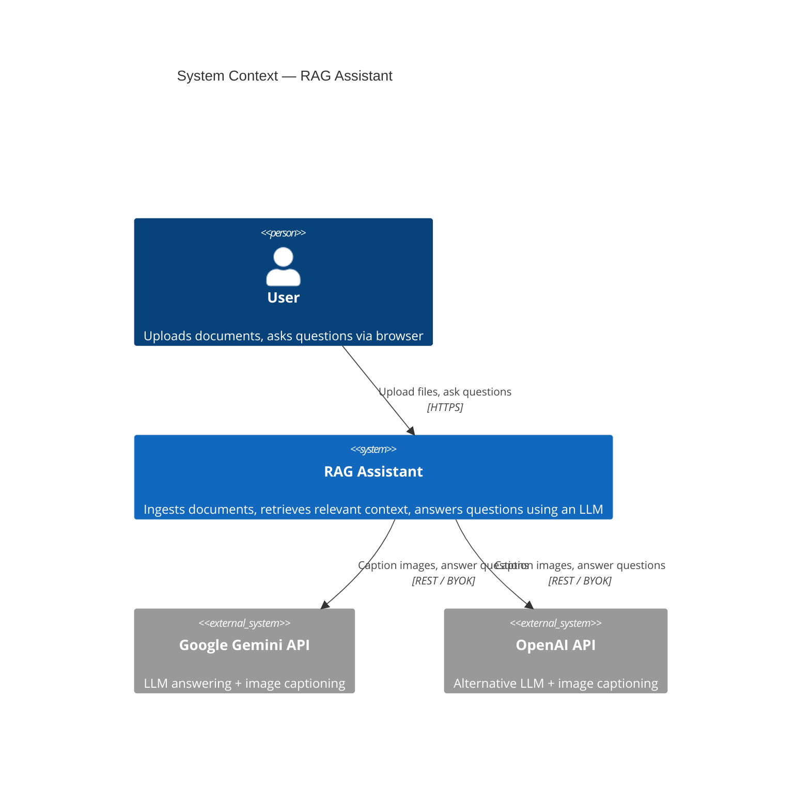
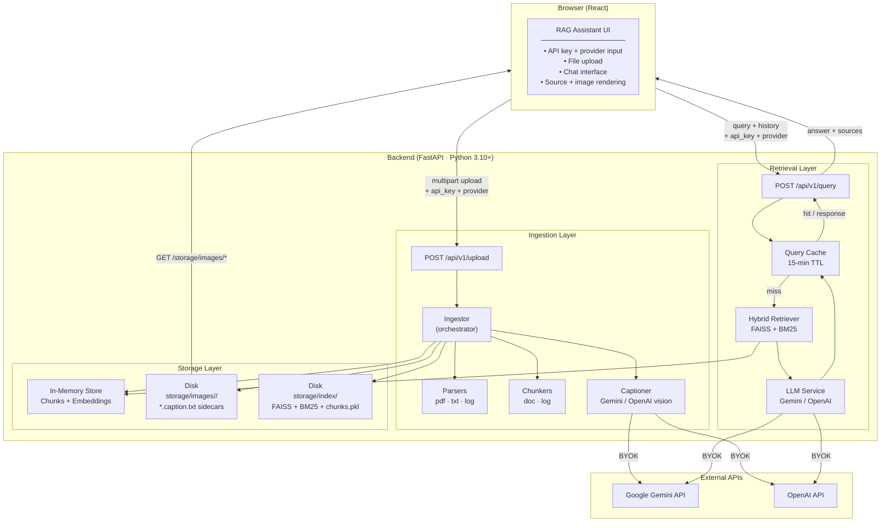
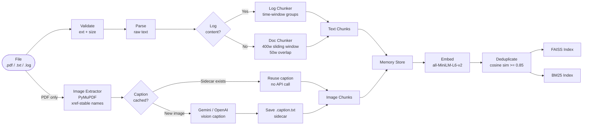
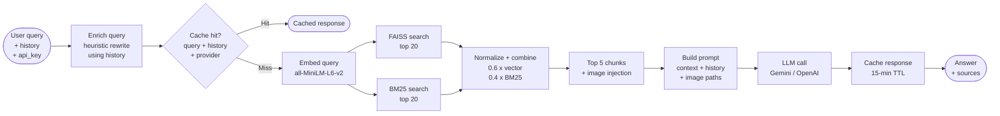
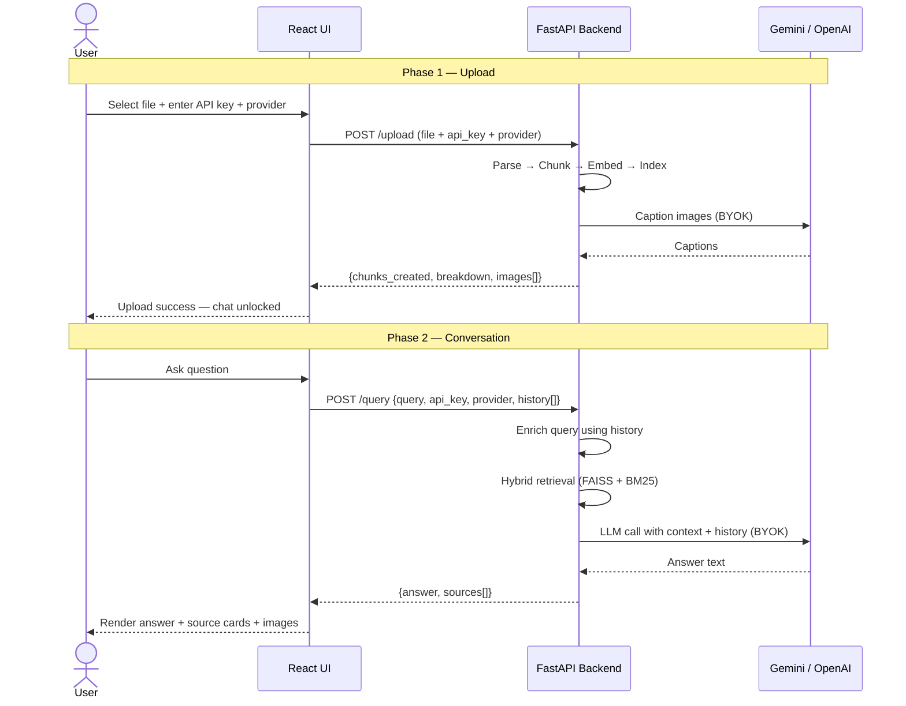

# RAG Assistant — High Level Design

> A Retrieval-Augmented Generation system that lets users upload documents and ask questions, receiving answers grounded in the uploaded content with source citations and diagram rendering.

---

## 1. System Context

---

## 2. High Level Architecture

---

## 3. Ingestion Pipeline

---

## 4. Query Pipeline

---

## 5. Data Flow — End to End

---

## 6. Component Responsibilities

| Component | Technology | Responsibility |
|---|---|---|
| **React UI** | React 18, plain CSS | Upload, chat, document list with delete, source rendering, image display |
| **FastAPI** | Python 3.10+, Uvicorn | HTTP routing, request validation, async orchestration |
| **Ingestor** | Python | Single pipeline entry point — coordinates all stages |
| **Delete Handler** | Python | Surgical per-document delete — removes chunks, FAISS vectors, BM25 index, image subdirectory, and persists updated state; failures collected as warnings |
| **PDF Parser** | pdfplumber | Text extraction from PDFs |
| **Image Extractor** | PyMuPDF (fitz) | Image extraction, xref-stable naming, per-doc subdirs |
| **Captioner** | google-genai / requests | Multimodal image captioning; sidecar persistence |
| **Doc Chunker** | Python | 400-word sliding window with 50-word overlap |
| **Log Chunker** | Python | Time-window grouping + summarisation |
| **Embedding Service** | sentence-transformers | `all-MiniLM-L6-v2` — 384-dim vectors |
| **Deduplication** | scikit-learn | Cosine similarity clustering at 0.85 threshold |
| **FAISS Index** | faiss-cpu | Dense vector search (inner product = cosine sim) |
| **BM25 Index** | rank-bm25 | Sparse keyword search |
| **Retrieval Service** | Python | Hybrid scoring + image injection |
| **LLM Service** | requests | Query enrichment, prompt building, BYOK LLM calls |
| **Cache Service** | Python stdlib | In-memory TTL cache keyed by query + history + provider |
| **Memory Store** | Python stdlib | In-process chunk store (list + dict) |
| **Disk Storage** | OS filesystem | Images + caption sidecars — survive server restarts |
| **Persistence Service** | faiss + pickle | Save/load FAISS index + BM25 corpus + chunks to disk on every upload |
| **DocList component** | React 18 | Collapsible sidebar list of all uploaded documents with per-doc delete buttons |
| **Correlation Middleware** | Starlette | Generate `x-correlation-id` per request; inject into all log records |
| **JSON Logger** | Python stdlib | Structured JSON log output with timestamp, level, logger, correlation ID |

---

## 7. Key Design Principles

| Principle | How it's applied |
|---|---|
| **Graceful degradation** | Image pipeline and retrieval indexing failures never break text ingestion |
| **BYOK (Bring Your Own Key)** | API keys passed per-request, never stored or logged |
| **Thin façade storage** | `memory_store.py` is the only file to change when swapping to a real vector DB |
| **Async-first** | All blocking I/O and CPU work runs in thread pool via `asyncio.to_thread()` |
| **Idempotent image storage** | xref-stable filenames + caption sidecars make re-uploads safe and cheap |
| **Conversation-aware retrieval** | Query enrichment rewrites follow-ups into standalone queries before retrieval |
| **History-aware caching** | Cache key includes a digest of recent history to prevent stale hits |
| **No server-side session state** | History is sent by the client on every request |
| **Restart-safe persistence** | FAISS + BM25 + chunks saved to disk after every upload; loaded on startup |
| **Idempotent re-upload** | Re-uploading the same file evicts old chunks before ingesting fresh — no duplicates |
| **Structured observability** | JSON logs + `x-correlation-id` on every request for end-to-end traceability |

---

## 8. Limitations & Future Work

| Area | Current state | Future improvement |
|---|---|---|
| **Persistence** | FAISS + BM25 + chunks saved to disk; loaded on startup | ✅ Implemented — `persistence_service.py` |
| **Vector DB** | In-memory FAISS | Swap `memory_store.py` + `vector_service.py` for Chroma / Pinecone |
| **Auth** | None | Add API key auth or OAuth |
| **Multi-tenancy** | Single shared store | Namespace chunks by user/session |
| **OCR** | Not supported | Add Tesseract for scanned PDFs |
| **Streaming** | Full response only | Stream LLM tokens via SSE |
| **Image cap** | 20 per PDF | Make configurable per-request |
| **Cache eviction** | TTL only, unbounded size | Add LRU eviction |
| **Frontend** | localhost only | Deploy behind HTTPS for key security |
