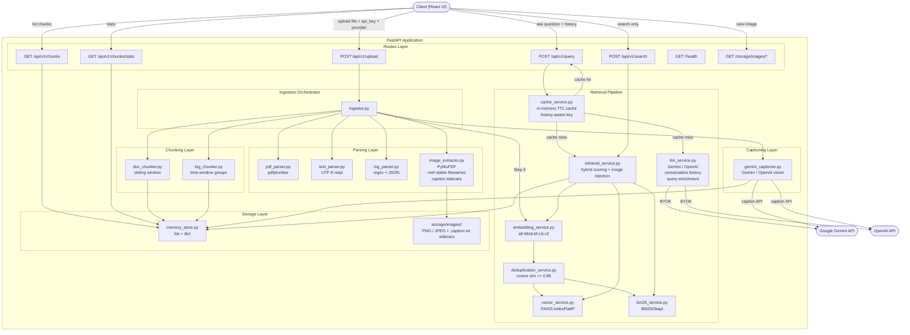
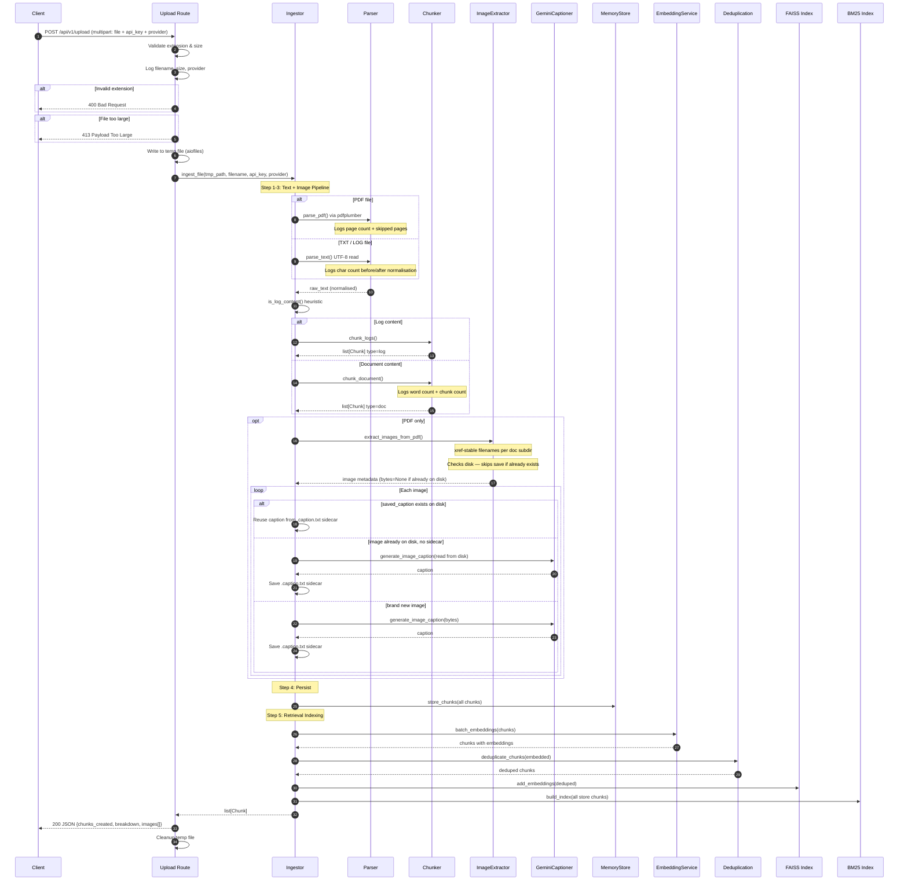
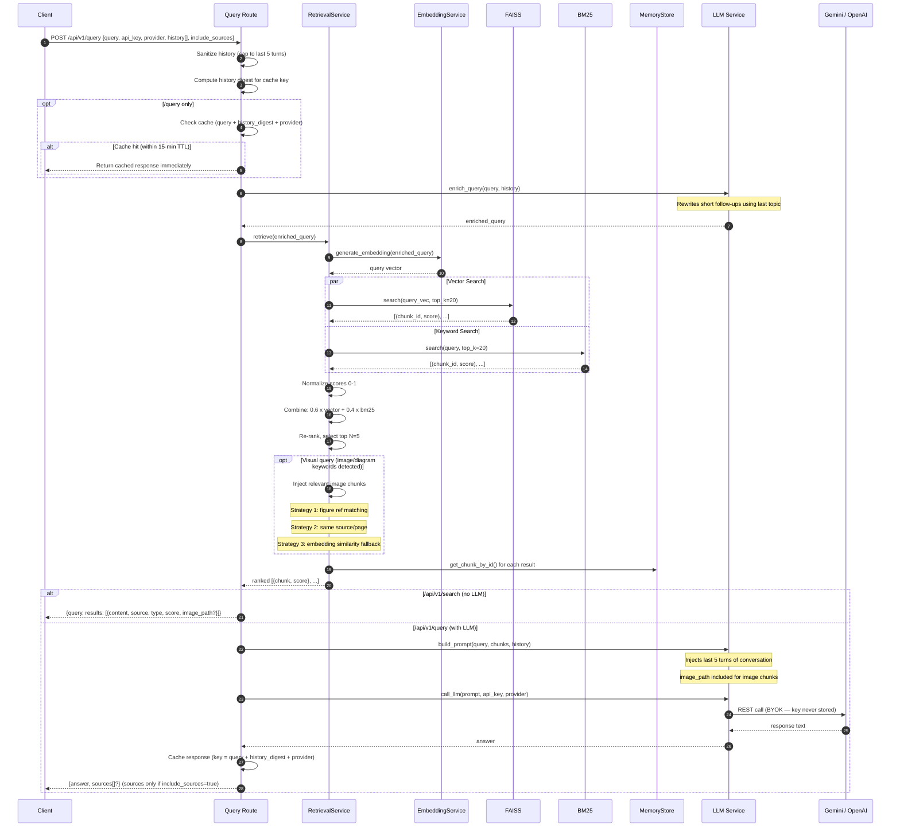
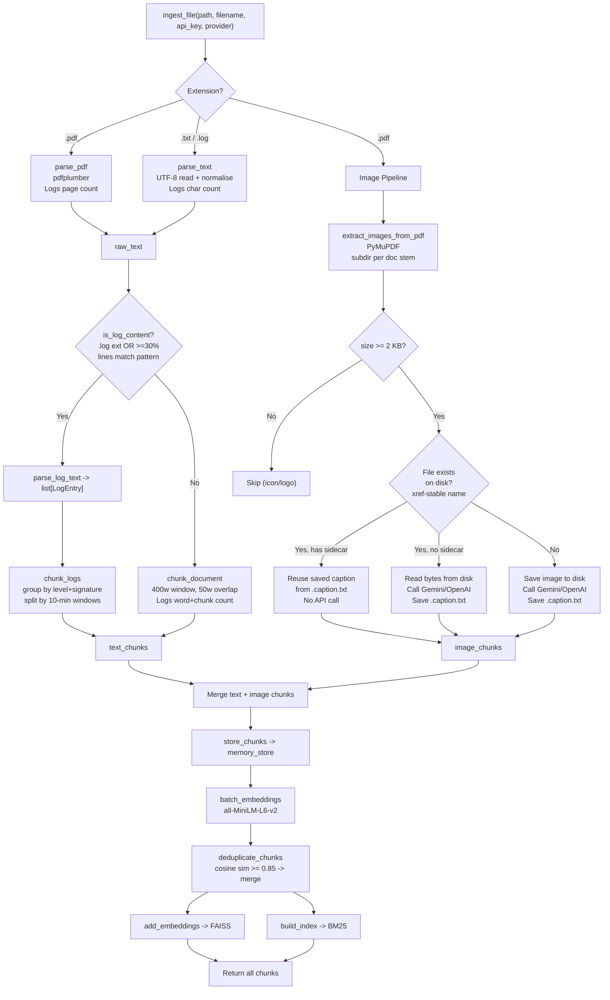
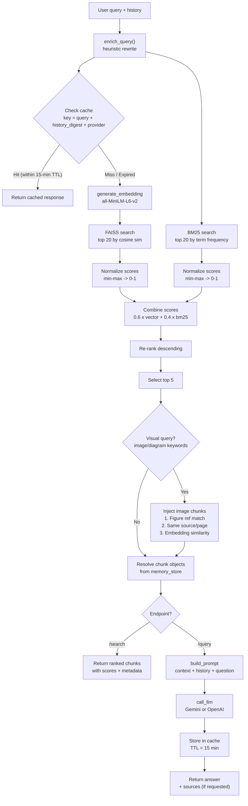
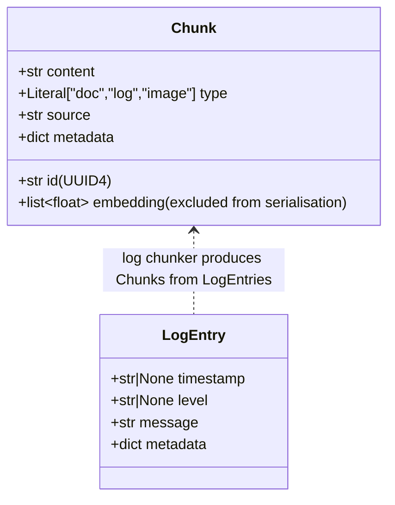
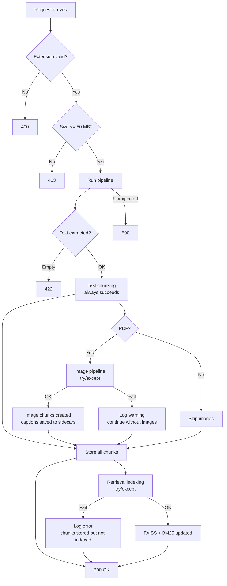

# RAG Ingestion & Retrieval Backend — Architecture & Technical Breakdown

> v2.1.0 · Python 3.10+ · FastAPI · Ingestion + Hybrid Retrieval + LLM Query + Conversation History

---

## 1. System Overview



---

## 2. Request Lifecycle — File Upload (Ingestion + Indexing)



---

## 3. Request Lifecycle — Query & Search



---

## 4. Ingestion Decision Tree



---

## 5. Image Storage & Caption Caching

Images are stored in a **per-document subdirectory** under `storage/images/`:

```
backend/storage/images/
├── system_design/
│   ├── page5_xref34.png          ← stable xref-based filename
│   ├── page5_xref34.caption.txt  ← sidecar caption (persists across restarts)
│   ├── page8_xref67.jpeg
│   └── page8_xref67.caption.txt
└── architecture/
    ├── page2_xref9.png
    └── page2_xref9.caption.txt
```

**Key design decisions:**

| Decision | Rationale |
|---|---|
| Subdirectory per PDF stem | Avoids flat-directory noise; easy to identify which doc owns which images |
| `xref` in filename (not loop index) | PyMuPDF's xref is stable across repeated extractions — same image always maps to same file |
| `.caption.txt` sidecar | Persists Gemini/OpenAI captions to disk so re-uploads skip API calls entirely |
| Caption reuse logic | `saved_caption` → reuse; `already_exists` + no sidecar → re-caption once and save; new → caption and save |

**Re-upload behaviour:**

| Scenario | Images saved | Gemini calls |
|---|---|---|
| First upload of `doc.pdf` (N images) | N written | N |
| Re-upload same `doc.pdf` | 0 (all exist) | 0 (captions from sidecars) |
| After server restart, re-upload | 0 (files on disk) | 0 (sidecars still there) |
| Upload `doc_v2.pdf` with 2 new images | 2 written | 2 |

---

## 6. Conversation History & Query Enrichment

The `/query` endpoint supports multi-turn conversation via the `history` field.

### Request shape

```json
{
  "query": "can you show me a diagram?",
  "api_key": "...",
  "provider": "gemini",
  "include_sources": true,
  "history": [
    {"role": "user",      "content": "explain the single server setup"},
    {"role": "assistant", "content": "A single server setup hosts..."}
  ]
}
```

### Query enrichment (`enrich_query`)

Short or context-dependent follow-ups are rewritten before retrieval so FAISS/BM25 find the right chunks:

```
"can you show me a diagram?"
  + last topic: "explain the single server setup"
  → "can you show me a diagram? (context: explain the single server setup)"
```

Triggers on: queries ≤ 10 words, or starting with `"show me"`, `"give me"`, `"what about"`, etc., or single-word answers like `"why"`, `"how"`.

### Prompt construction (`build_prompt`)

The final LLM prompt includes:
1. System prompt with image-referencing rules
2. Last 5 turns of conversation history (most recent last)
3. Retrieved context chunks (text + image captions with `image_path`)
4. The current question

### Cache key with history

The cache key is `query + history_digest + provider` where `history_digest` is an MD5 of the last 2 turns. This prevents stale cache hits when the same question is asked in a different conversation context.

---

## 7. Hybrid Retrieval Flow



---

## 8. Component Breakdown

### 8.1 Routes Layer

| Endpoint | Method | Module | Purpose |
|---|---|---|---|
| `/api/v1/upload` | POST | `routes/upload.py` | Accept file + api_key + provider, run ingestion + indexing |
| `/api/v1/chunks` | GET | `routes/chunks.py` | Paginated chunk listing with optional `?source=` filter |
| `/api/v1/chunks/stats` | GET | `routes/chunks.py` | Aggregate counts by type + source list |
| `/api/v1/chunks/index-stats` | GET | `routes/chunks.py` | FAISS and BM25 index state |
| `/api/v1/chunks/cache-stats` | GET | `routes/chunks.py` | Query cache statistics |
| `/api/v1/query` | POST | `routes/query.py` | Hybrid retrieval + LLM answer (cached, BYOK, supports history) |
| `/api/v1/search` | POST | `routes/query.py` | Hybrid retrieval only — no LLM key needed |
| `/storage/images/*` | GET | `main.py` (StaticFiles) | Serve extracted PDF images (subdirectory-aware) |
| `/health` | GET | `main.py` | Liveness probe |

Error codes:

| Code | Condition |
|---|---|
| 400 | Unsupported file extension / unknown LLM provider |
| 413 | File exceeds 50 MB |
| 422 | Empty file, unreadable, or bad format |
| 500 | Unexpected internal error / retrieval failure |
| 502 | LLM API call failed |

### 8.2 Ingestion Orchestrator (`ingestor.py`)

Single entry point for the entire pipeline. Runs 5 steps:

| Step | Operation | Failure mode |
|---|---|---|
| 1 | Parse raw text | Raises `ValueError` (propagates to 422) |
| 2 | Chunk text (doc or log) | Always succeeds |
| 3 | Image pipeline (PDF only) | Swallowed — text chunks preserved |
| 4 | Store chunks in memory | Always succeeds |
| 5 | Embed + dedup + index | Swallowed — chunks stored but not searchable |

### 8.3 Parsing Layer

| Module | Input | Output | Notes |
|---|---|---|---|
| `pdf_parser.py` | `.pdf` path | Normalised text | Logs page count + skipped pages |
| `text_parser.py` | `.txt`/`.log` path | Normalised text | Logs char count before/after |
| `log_parser.py` | Raw text | `list[LogEntry]` | JSON + regex patterns |
| `image_extractor.py` | `.pdf` path | Image metadata + bytes | xref-stable names, per-doc subdir, caption sidecars |

### 8.4 Captioning Layer (`gemini_captioner.py`)

- Supports **Gemini** (default) and **OpenAI** vision models
- Provider selected per-request via `provider` field
- 2 retries with 1.5s delay; falls back to `FALLBACK_CAPTION` on total failure
- API key passed per-request, never stored

### 8.5 Retrieval Pipeline

| Module | Purpose |
|---|---|
| `embedding_service.py` | Lazy-loaded `all-MiniLM-L6-v2`; single + batch embedding |
| `deduplication_service.py` | Union-find clustering at cosine sim ≥ 0.85; preserves image_paths |
| `vector_service.py` | FAISS `IndexFlatIP` (inner product on L2-normalised = cosine sim) |
| `bm25_service.py` | `BM25Okapi`; rebuilt from full store on every upload |
| `retrieval_service.py` | Hybrid scoring + image injection (3-strategy) |
| `llm_service.py` | Query enrichment + prompt builder + BYOK LLM calls |
| `cache_service.py` | In-memory TTL cache; key includes history digest |

### 8.6 Storage Layer

| Structure | Type | Purpose |
|---|---|---|
| `memory_store._chunks` | `list[Chunk]` | Insertion-ordered; supports pagination |
| `memory_store._index` | `dict[str, Chunk]` | O(1) lookup by chunk ID |
| `storage/images/<stem>/` | Files on disk | Images + `.caption.txt` sidecars; survive server restarts |

---

## 9. Data Models



Metadata by chunk type:

| Type | Metadata keys |
|---|---|
| `doc` | `chunk_index`, `word_count`, `start_word`, `end_word` |
| `log` | `level`, `count`, `top_message`, `unique_messages`, `window_start`*, `window_end`* |
| `image` | `page`, `image_index`, `image_path`, `filename` |
| merged | all above + `merged_sources`, `merged_count`, `image_paths` |

*present only when timestamps were available

---

## 10. Error Handling Strategy



---

## 11. Configuration Reference

All constants live in `app/config.py`.

### Ingestion

| Constant | Value | Purpose |
|---|---|---|
| `MAX_UPLOAD_SIZE_BYTES` | 50 MB | Upload size limit |
| `ALLOWED_EXTENSIONS` | `.pdf`, `.txt`, `.log` | Accepted file types |
| `DOC_CHUNK_SIZE_WORDS` | 400 | Words per document chunk |
| `DOC_OVERLAP_WORDS` | 50 | Overlap between chunks |
| `LOG_TIME_WINDOW_MINUTES` | 10 | Log grouping bucket width |
| `MAX_IMAGES_PER_PDF` | 20 | Hard cap per PDF |
| `MIN_IMAGE_SIZE_BYTES` | 2 KB | Skip icons/logos below this |
| `IMAGES_DIR` | `backend/storage/images/` | Root image storage directory |
| `IMAGES_URL_PREFIX` | `/storage/images` | Static files URL mount |
| `GEMINI_API_KEY` | env var | Google AI key (optional) |
| `GEMINI_MODEL` | `gemini-2.5-flash` | Captioning model |

### Retrieval

| Constant | Value | Purpose |
|---|---|---|
| `EMBEDDING_MODEL` | `all-MiniLM-L6-v2` | Sentence-transformers model |
| `EMBEDDING_DIMENSION` | 384 | Output vector dimension |
| `DEDUP_SIMILARITY_THRESHOLD` | 0.85 | Cosine sim above this → merge |
| `HYBRID_VECTOR_WEIGHT` | 0.6 | FAISS score weight |
| `HYBRID_BM25_WEIGHT` | 0.4 | BM25 score weight |
| `RETRIEVAL_TOP_K` | 20 | Candidates from each retriever |
| `RERANK_TOP_N` | 5 | Final chunks after re-ranking |

### Cache

| Constant | Value | Purpose |
|---|---|---|
| `CACHE_TTL_SECONDS` | 900 (15 min) | TTL for cached query responses |

---

## 12. Async Architecture

FastAPI is async-first. The event loop is never blocked:

```
Event Loop (async)
  │
  ├── Ingestion Pipeline
  │   ├── asyncio.to_thread(parse_pdf)              → Thread pool (CPU)
  │   ├── asyncio.to_thread(parse_text)             → Thread pool (I/O)
  │   ├── asyncio.to_thread(extract_images)         → Thread pool (CPU + I/O)
  │   ├── asyncio.to_thread(generate_caption)       → Thread pool (Network)
  │   ├── asyncio.to_thread(batch_embeddings)       → Thread pool (CPU — model inference)
  │   ├── asyncio.to_thread(deduplicate_chunks)     → Thread pool (CPU — similarity matrix)
  │   ├── asyncio.to_thread(add_embeddings)         → Thread pool (FAISS)
  │   └── asyncio.to_thread(build_index)            → Thread pool (BM25)
  │
  └── Query Pipeline
      ├── cache_service.get_cache()                  → Sync dict lookup (instant)
      ├── asyncio.to_thread(retrieve)               → Thread pool (embed + search + rank)
      ├── asyncio.to_thread(call_llm)               → Thread pool (Network — Gemini/OpenAI)
      └── cache_service.set_cache()                  → Sync dict write (instant)
```

---

## 13. Persistence & Restart Behaviour

| Data | Storage | Survives restart? |
|---|---|---|
| Text/log chunks | In-memory (`memory_store`) | No — re-upload required |
| FAISS vector index | In-memory | No — rebuilt on re-upload |
| BM25 index | In-memory | No — rebuilt on re-upload |
| Query response cache | In-memory | No — cleared on restart |
| Embedding model weights | Lazy-loaded from disk | Yes (sentence-transformers cache) |
| Extracted images | `storage/images/<stem>/` on disk | Yes |
| Caption sidecars | `storage/images/<stem>/*.caption.txt` | Yes — re-uploads skip Gemini calls |

---

## 14. Key Design Decisions

| Decision | Rationale |
|---|---|
| Single orchestrator (`ingestor.py`) | One place to understand the full pipeline; routes stay thin |
| `memory_store.py` as thin façade | Swap to any vector DB by replacing one file |
| Image pipeline isolated with `try/except` | Text ingestion must never fail because of image issues |
| Retrieval indexing isolated with `try/except` | Chunks are always stored even if indexing fails |
| `asyncio.to_thread()` for all blocking ops | Keeps the event loop responsive under concurrent requests |
| Fallback caption instead of error | Partial results are more useful than total failure |
| Per-document image subdirectory | Clean separation; easy to identify ownership; no flat-dir noise |
| xref-based image filenames | Stable across repeated extractions — same image always same file |
| `.caption.txt` sidecar files | Captions persist to disk; re-uploads and restarts skip Gemini API calls |
| Hybrid retrieval (FAISS + BM25) | Combines semantic understanding with keyword precision |
| Cosine dedup at 0.85 threshold | Reduces redundancy without losing distinct content |
| BYOK for LLM calls | No stored keys — user provides per request; key never logged |
| Separate `/search` and `/query` endpoints | Test retrieval quality without needing an LLM key |
| Lazy model loading | App starts fast; embedding model loads on first use |
| Image captions treated as text for embedding | Enables semantic search over diagrams via their descriptions |
| `image_path` preserved through entire pipeline | Frontend can render diagrams alongside text results |
| Conversation history in query request | Multi-turn context without server-side session state |
| Query enrichment via heuristics | Short follow-ups resolved to full queries without extra LLM call |
| History digest in cache key | Same question in different conversation contexts gets separate cache entries |
| `include_sources` flag on query | Sources are optional — reduces response payload when not needed |
| Provider passed to upload and query | Same API key used for both image captioning and LLM answering |
